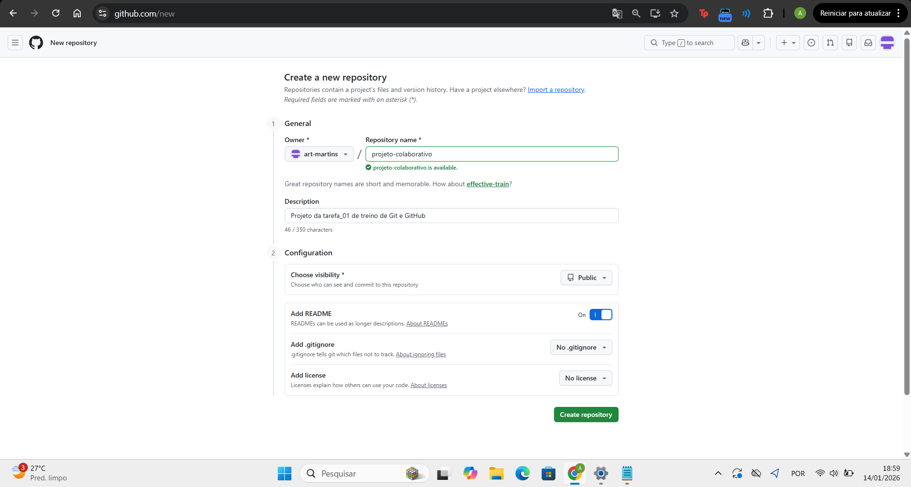
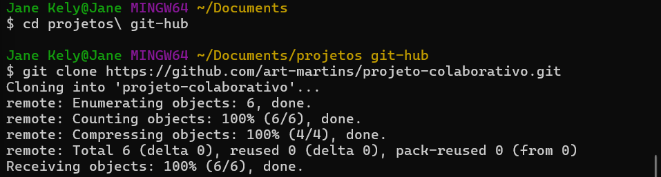
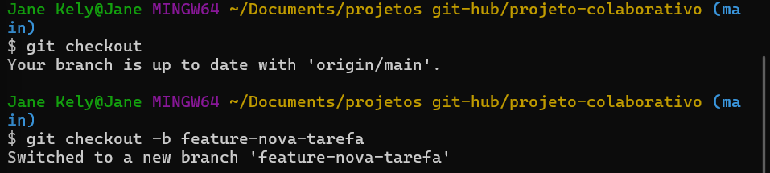
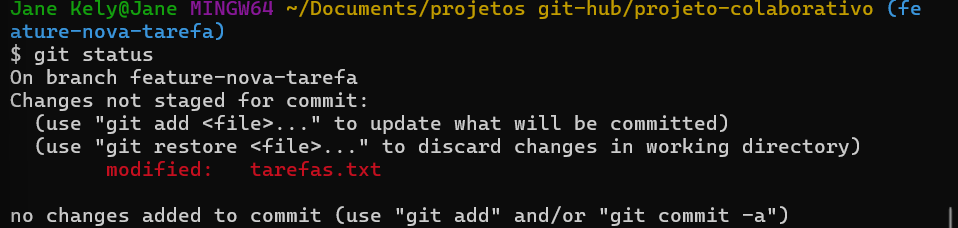
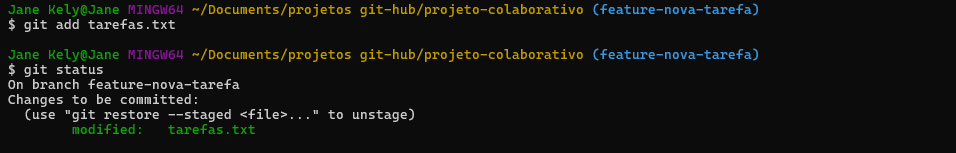
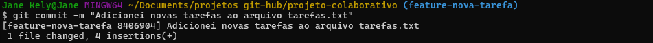
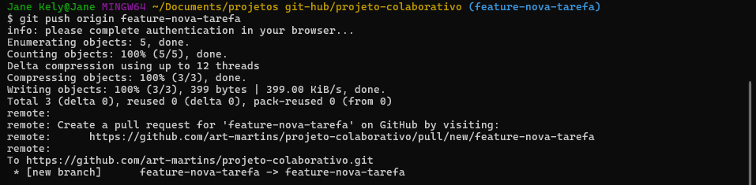
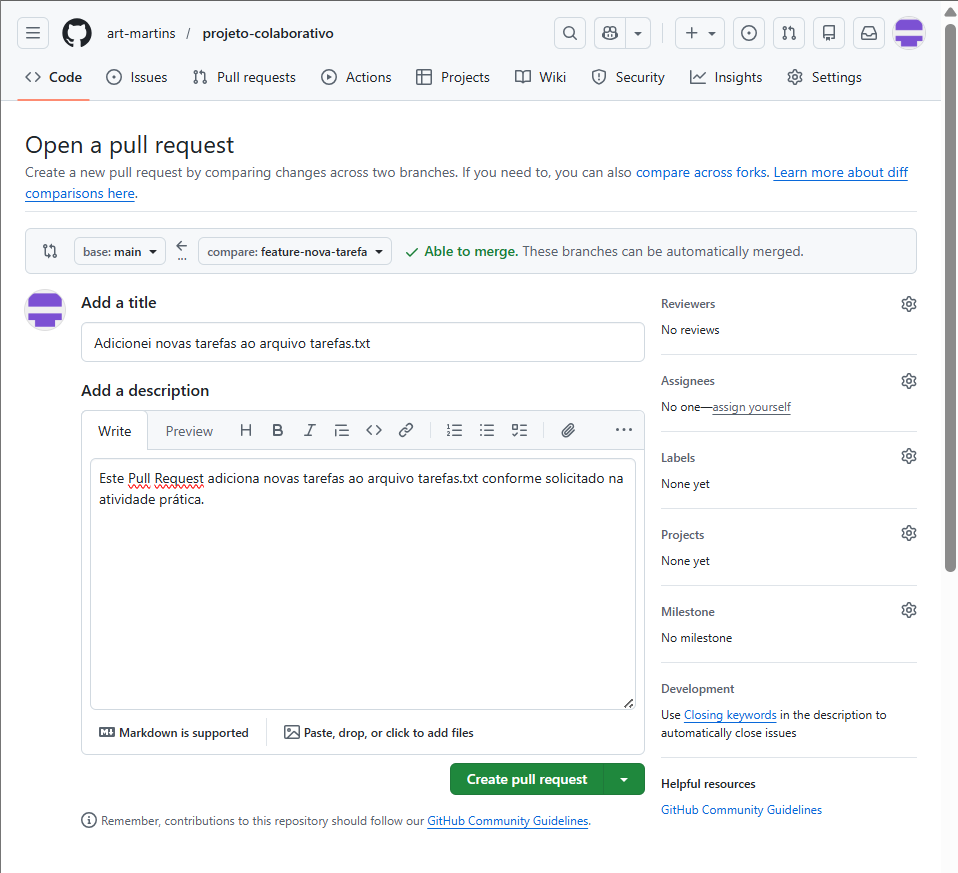
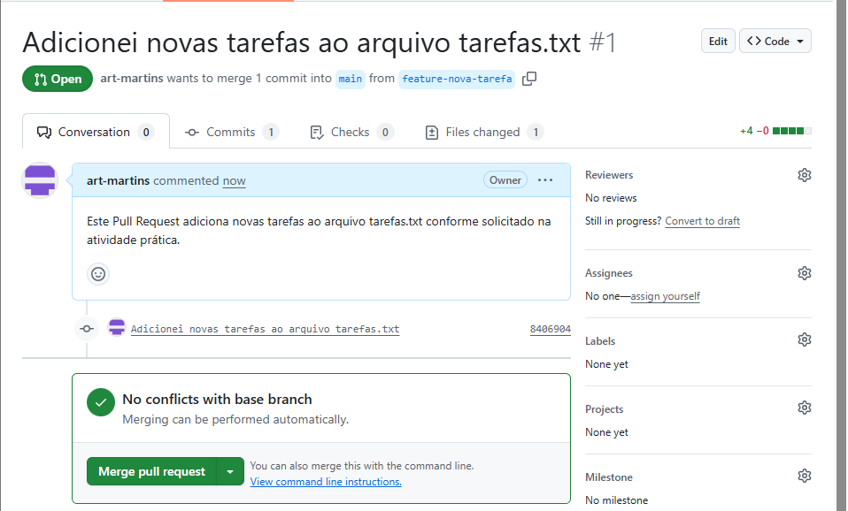

# projeto-colaborativo
Projeto da tarefa_01 de treino de Git e GitHub
## 1. Criação do repositório no GitHub

Nesta etapa foi criado um repositório chamado `projeto-colaborativo` diretamente no GitHub. Com a criação dos arquivos "README.md" e "tarefas.txt".

---

## 2. Clonagem do repositório

O repositório remoto foi clonado para a máquina local utilizando o comando "git clone".

---

## 3. Sincronização com o repositório remoto (git pull)

Após a clonagem, foi executado o comando "git pull".  
Como não havia alterações adicionais no repositório remoto, o Git retornou a mensagem
informando que o repositório já estava atualizado.

---

## 4. Criação da branch de desenvolvimento

Foi criada uma nova branch chamada "feature-nova-tarefa", onde as alterações foram realizadas
sem afetar diretamente a branch principal ("main").

---

## 5. Alteração do arquivo "tarefas.txt" e verificação das alterações (git status)

Após a edição do arquivo e inserção de duas novas "tarefas", foi utilizado o comando "git status" para verificar os arquivos modificados.

---

## 6. Preparação e commit das alterações (git add) e (git commit)

O arquivo modificado foi adicionado à staging area e, em seguida, foi realizado o commit
com uma mensagem descritiva.

---

## 7. Envio da branch para o repositório remoto (git push)

A branch "feature-nova-tarefa" foi enviada para o repositório remoto no GitHub utilizando o comando "git push".

---

## 8. Abertura do Pull Request

Após o envio da branch, foi aberto um Pull Request solicitando a integração das alterações
da branch `feature-nova-tarefa` para a branch `main`.

---
## 9. Pull Request criado com sucesso

O Pull Request foi criado com sucesso e ficou disponível para revisão e aprovação, finalizando o fluxo básico de colaboração proposto na atividade.

---
## 🔗 Links

- Repositório: https://github.com/art-martins/projeto-colaborativo
- Pull Request: https://github.com/art-martins/projeto-colaborativo/pull/1